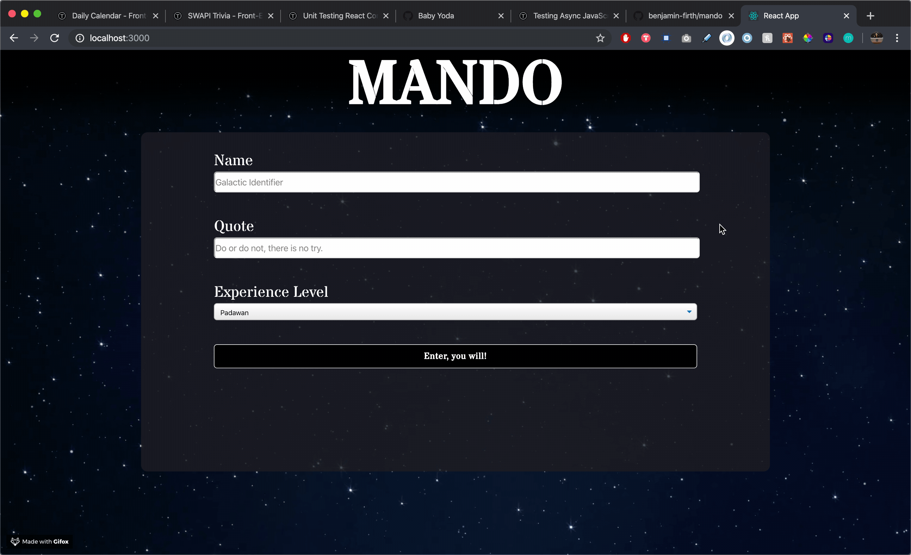
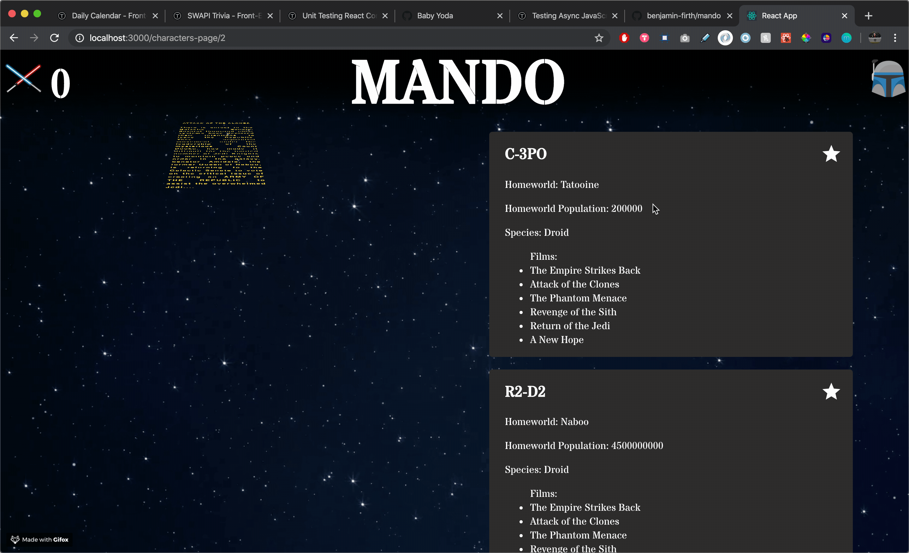
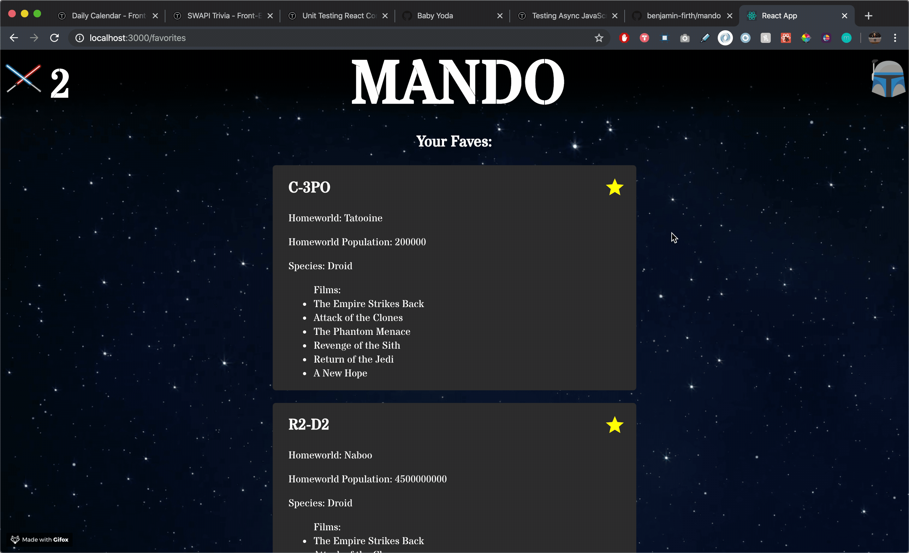

# Mando

## Welcome to Nick and Ben's 'Mando' Star Wars Project

Have you ever needed information on ONLY the first 7 Star Wars Movies? Look no further!

## Setup

Feel free to pull down this repo, run 'npm install'

To verify that it is setup correctly, run `npm start` in your terminal. Go to `http://localhost:3000/`. Enter `control + c` in your terminal to stop the server at any time.

If you want, feel free to run `npm test` to check out our coverage and make sure everything is passing!

### Wins

This project had a lot of ups and downs. I would say some of the best things that were accomplished: 
1. Implementing testing in React as well as for async functions such as fetch. We needed to mock window.fetch which was an adventure to make sure our tests are still robust.
1. Although the SCSS/CSS was not a focus, we enjoyed creating a loading component and finding a way to create the 'opening crawl' text look like the intro of a movie.
1. It was important to us to get as close to 100% tested as possible. Besides some ComponentDidMount and Router testing, we were able to test everything else.

### Challenges

Some of the bigger challenges of this project:
1. Understanding and getting a deeper idea of what's happening with React Router and React 'under the hood.' React makes writing JavaScript a quicker process, but making sure we fully understand what's going on took some productive struggle.
1. We are still researching and determining what and when to test. We know that checking coverage is a good pulse check, but it's important to first make sure the tests themselves check what you want and test everything that can happen.

### Future Iterations

If given more time:
1. We would have created a more interactive experience for the user. More animations and exciting UI for the user to experience with, such as a spaceship landing page intro. 
1. We would like to ensure that our application is 100% accessible. It wasn't a priority for this one week project, but that's something we would like to ensure if given more time.
1. We would like to dive deeper into testing and understand the best way to test React Router that ensures everything is happening correctly.

### ScreenShots
#### Welcome Page

#### Movie Page

#### Character Loading

#### Character Fully Fetched

#### Favorites Page

## Collaborators

[Nick Nist](https://github.com/nicknist) | [Ben Firth](https://github.com/benjamin-firth)
